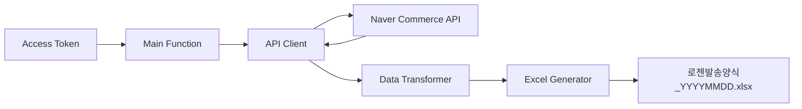

# Design Document: Naver Smart Store - Logen Delivery Integration

## Overview

This feature provides a Python-based solution to automate the process of fetching order data from Naver Smart Store and converting it into Logen delivery service's bulk shipping Excel format. The system bridges the gap between Naver's e-commerce platform and Logen's logistics system, eliminating manual data entry and reducing errors.

The solution consists of three main components:
1. Naver Commerce API client for fetching order data
2. Data transformation layer to map Naver order fields to Logen format
3. Excel file generator using Logen's specific template format

The system is designed as a standalone Python function that accepts an access token and produces a dated Excel file ready for upload to Logen's bulk shipping system.

## Architecture

### High-Level Architecture



### Component Responsibilities

**API Client Module**
- Handles HTTP communication with Naver Commerce API
- Manages authentication using provided access token
- Implements retry logic for transient failures
- Filters orders by payment status (결제완료) and shipping status (발송대기)

**Data Transformer Module**
- Maps Naver order fields to Logen delivery format
- Combines address fields (baseAddress + detailedAddress)
- Validates required fields are present
- Handles missing or malformed data gracefully

**Excel Generator Module**
- Creates Excel workbook using openpyxl
- Applies Logen's specific column structure
- Formats cells according to Logen requirements
- Generates filename with current date


## Components and Interfaces

### 1. Main Function Interface

```python
def generate_logen_shipping_file(access_token: str) -> str:
    """
    Fetches orders from Naver Smart Store and generates Logen shipping Excel file.
    
    Args:
        access_token: OAuth2 access token for Naver Commerce API
        
    Returns:
        str: Path to generated Excel file
        
    Raises:
        NaverAPIError: When API request fails
        DataTransformError: When data transformation fails
        ExcelGenerationError: When Excel file creation fails
    """
```

### 2. API Client Interface

```python
class NaverCommerceClient:
    def __init__(self, access_token: str):
        """Initialize client with access token."""
        
    def fetch_orders(self, 
                     payment_status: str = "PAYED",
                     shipping_status: str = "READY") -> List[Dict]:
        """
        Fetch orders from Naver Commerce API.
        
        Args:
            payment_status: Payment status filter (default: PAYED)
            shipping_status: Shipping status filter (default: READY)
            
        Returns:
            List of order dictionaries
            
        Raises:
            NaverAPIError: When API request fails
        """
```

### 3. Data Transformer Interface

```python
class OrderTransformer:
    @staticmethod
    def transform_to_logen_format(orders: List[Dict]) -> List[Dict]:
        """
        Transform Naver orders to Logen delivery format.
        
        Args:
            orders: List of Naver order dictionaries
            
        Returns:
            List of dictionaries with Logen format fields:
            - receiverName: 받는사람
            - fullAddress: 주소 (baseAddress + detailedAddress)
            - receiverTel: 전화번호
            - productName: 상품명
            - deliveryMemo: 배송메모
            
        Raises:
            DataTransformError: When required fields are missing
        """
```

### 4. Excel Generator Interface

```python
class LogenExcelGenerator:
    @staticmethod
    def generate_excel(data: List[Dict], output_path: str) -> str:
        """
        Generate Logen shipping Excel file.
        
        Args:
            data: List of transformed order dictionaries
            output_path: Path for output Excel file
            
        Returns:
            str: Path to generated file
            
        Raises:
            ExcelGenerationError: When file creation fails
        """
```


## Data Models

### Naver Order Data Model

Based on Naver Commerce API v1 specification:

```python
@dataclass
class NaverOrder:
    """Naver Commerce API order structure (relevant fields)."""
    order_id: str
    product_order_id: str
    receiver_name: str  # receiverName
    base_address: str  # baseAddress
    detailed_address: str  # detailedAddress
    receiver_tel1: str  # receiverTel1
    product_name: str  # productName
    delivery_memo: str  # deliveryMemo
    payment_status: str  # PAYED, CANCELED, etc.
    shipping_status: str  # READY, DISPATCHED, DELIVERED, etc.
```

### Logen Delivery Data Model

Based on Logen bulk shipping Excel format:

```python
@dataclass
class LogenShipment:
    """Logen delivery Excel format structure."""
    receiver_name: str  # Column A: 받는사람
    full_address: str  # Column B: 주소
    receiver_tel: str  # Column C: 전화번호
    product_name: str  # Column D: 상품명
    delivery_memo: str  # Column E: 배송메모
```

### Field Mapping

| Naver Field | Logen Field | Transformation |
|-------------|-------------|----------------|
| receiverName | receiver_name | Direct copy |
| baseAddress + detailedAddress | full_address | Concatenate with space |
| receiverTel1 | receiver_tel | Direct copy |
| productName | product_name | Direct copy |
| deliveryMemo | delivery_memo | Direct copy (empty string if null) |

### Excel File Structure

- Filename format: `로젠발송양식_{YYYYMMDD}.xlsx`
- Sheet name: "Sheet1" (default)
- Header row (Row 1): 받는사람, 주소, 전화번호, 상품명, 배송메모
- Data rows: Start from Row 2
- No formatting requirements (plain text)


## Correctness Properties

*A property is a characteristic or behavior that should hold true across all valid executions of a system—essentially, a formal statement about what the system should do. Properties serve as the bridge between human-readable specifications and machine-verifiable correctness guarantees.*

### Property 1: API Status Filtering

*For any* valid access token, when fetching orders from Naver Commerce API, the system should request only orders with payment status "PAYED" and shipping status "READY".

**Validates: Requirements 1.1**

### Property 2: Direct Field Mapping Preservation

*For any* Naver order data, when transforming to Logen format, the fields receiverName, receiverTel1, and productName should be copied directly without modification.

**Validates: Requirements 1.2, 1.4, 1.5**

### Property 3: Address Concatenation

*For any* Naver order with baseAddress and detailedAddress fields, when transforming to Logen format, the full_address field should equal baseAddress concatenated with a space and detailedAddress.

**Validates: Requirements 1.3**

### Property 4: Filename Date Format

*For any* execution date, when generating the Excel file, the filename should match the pattern "로젠발송양식_{YYYYMMDD}.xlsx" where YYYYMMDD represents the current date.

**Validates: Requirements 1.7**

### Property 5: Excel Row Structure

*For any* list of transformed orders, when generating the Excel file, each order should appear as a single row starting from row 2, with the number of data rows equal to the number of orders.

**Validates: Requirements 1.9**

### Property 6: API Error Propagation

*For any* API request failure, the system should raise a NaverAPIError exception with an error message describing the failure.

**Validates: Requirements 1.10**

### Property 7: Data Validation Error Handling

*For any* order data missing required fields (receiverName, baseAddress, detailedAddress, receiverTel1, or productName), the transformation should raise a DataTransformError exception.

**Validates: Requirements 1.12**


## Error Handling

### Error Types

**NaverAPIError**
- Raised when: HTTP request to Naver Commerce API fails
- Scenarios:
  - Network connectivity issues
  - Invalid or expired access token (401 Unauthorized)
  - Rate limiting (429 Too Many Requests)
  - Server errors (5xx status codes)
- Handling: Include HTTP status code and response body in error message

**DataTransformError**
- Raised when: Order data cannot be transformed to Logen format
- Scenarios:
  - Missing required fields (receiverName, baseAddress, detailedAddress, receiverTel1, productName)
  - Invalid data types
  - Malformed data that cannot be processed
- Handling: Include order ID and missing field names in error message

**ExcelGenerationError**
- Raised when: Excel file creation fails
- Scenarios:
  - File system permission issues
  - Disk space exhausted
  - Invalid file path
  - openpyxl library errors
- Handling: Include file path and underlying error in error message

### Error Handling Strategy

1. **API Retry Logic**: Implement exponential backoff for transient failures (network errors, 5xx responses)
   - Maximum 3 retry attempts
   - Initial delay: 1 second
   - Exponential multiplier: 2x

2. **Validation**: Validate all required fields before transformation
   - Fail fast on missing required fields
   - Provide clear error messages indicating which order and which field

3. **Graceful Degradation**: For optional fields (deliveryMemo)
   - Use empty string if field is null or missing
   - Continue processing without raising error

4. **Logging**: Log all errors with context
   - API requests: URL, headers (excluding token), status code, response
   - Transformations: Order ID, field names, values
   - File operations: File path, operation type


## Testing Strategy

### Dual Testing Approach

This feature will be validated using both unit tests and property-based tests to ensure comprehensive coverage:

- **Unit tests**: Verify specific examples, edge cases, and error conditions
- **Property tests**: Verify universal properties across all inputs

Together, these approaches provide comprehensive coverage where unit tests catch concrete bugs and property tests verify general correctness.

### Property-Based Testing

**Library**: `hypothesis` (Python property-based testing library)

**Configuration**: Each property test will run a minimum of 100 iterations to ensure thorough randomized input coverage.

**Test Tagging**: Each property test will include a comment referencing its design document property:
```python
# Feature: naver-smartstore-logen-integration, Property 1: API Status Filtering
```

**Property Test Cases**:

1. **Property 1 - API Status Filtering**
   - Generate: Random valid access tokens
   - Test: Verify API client sends correct status filter parameters
   - Tag: `Feature: naver-smartstore-logen-integration, Property 1: API Status Filtering`

2. **Property 2 - Direct Field Mapping Preservation**
   - Generate: Random Naver order objects with various receiverName, receiverTel1, productName values
   - Test: Verify transformed data contains identical values for these fields
   - Tag: `Feature: naver-smartstore-logen-integration, Property 2: Direct Field Mapping Preservation`

3. **Property 3 - Address Concatenation**
   - Generate: Random baseAddress and detailedAddress strings
   - Test: Verify full_address equals baseAddress + " " + detailedAddress
   - Tag: `Feature: naver-smartstore-logen-integration, Property 3: Address Concatenation`

4. **Property 4 - Filename Date Format**
   - Generate: Random dates
   - Test: Verify filename matches pattern with correct date
   - Tag: `Feature: naver-smartstore-logen-integration, Property 4: Filename Date Format`

5. **Property 5 - Excel Row Structure**
   - Generate: Random lists of transformed orders (0 to 100 orders)
   - Test: Verify Excel has header row + N data rows where N = order count
   - Tag: `Feature: naver-smartstore-logen-integration, Property 5: Excel Row Structure`

6. **Property 6 - API Error Propagation**
   - Generate: Random HTTP error responses (4xx, 5xx)
   - Test: Verify NaverAPIError is raised with appropriate message
   - Tag: `Feature: naver-smartstore-logen-integration, Property 6: API Error Propagation`

7. **Property 7 - Data Validation Error Handling**
   - Generate: Random orders with one or more required fields missing
   - Test: Verify DataTransformError is raised
   - Tag: `Feature: naver-smartstore-logen-integration, Property 7: Data Validation Error Handling`

### Unit Testing

**Library**: `pytest` (Python testing framework)

**Unit Test Cases**:

1. **Example: Excel Header Row**
   - Test: Generate Excel with sample data
   - Verify: First row contains exactly ["받는사람", "주소", "전화번호", "상품명", "배송메모"]

2. **Example: Empty Orders List**
   - Test: Generate Excel with empty orders list
   - Verify: Excel contains only header row (1 row total)

3. **Edge Case: Missing deliveryMemo**
   - Test: Transform order with null deliveryMemo
   - Verify: Transformed data has empty string for delivery_memo

4. **Edge Case: Empty String Fields**
   - Test: Transform order with empty string in optional fields
   - Verify: Transformation succeeds without error

5. **Integration: End-to-End Success Path**
   - Test: Mock API response with sample orders
   - Verify: Excel file is created with correct data

6. **Integration: API Authentication Failure**
   - Test: Mock 401 Unauthorized response
   - Verify: NaverAPIError raised with "authentication" in message

7. **Integration: Network Timeout**
   - Test: Mock network timeout
   - Verify: Retry logic executes and eventually raises NaverAPIError

### Test Data Strategy

**Hypothesis Strategies**:
```python
from hypothesis import strategies as st

# Generate valid Korean names
korean_names = st.text(alphabet=st.characters(whitelist_categories=('Lo',)), min_size=2, max_size=10)

# Generate Korean addresses
korean_addresses = st.text(alphabet=st.characters(whitelist_categories=('Lo', 'Nd')), min_size=10, max_size=100)

# Generate phone numbers
phone_numbers = st.from_regex(r'^01[0-9]-[0-9]{4}-[0-9]{4}$')

# Generate product names
product_names = st.text(min_size=1, max_size=100)

# Generate complete orders
naver_orders = st.builds(
    NaverOrder,
    receiver_name=korean_names,
    base_address=korean_addresses,
    detailed_address=korean_addresses,
    receiver_tel1=phone_numbers,
    product_name=product_names,
    delivery_memo=st.one_of(st.none(), st.text(max_size=200))
)
```

### Coverage Goals

- Line coverage: > 90%
- Branch coverage: > 85%
- All error paths must be tested
- All public interfaces must have tests

